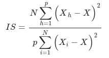

##### Definition

Interdaily Stability (IS) compares sleep-wake patterns over multiple days. It is calculated as the ratio of the variance within the same time interval each day and the overall variance.

IS is calculated using binary sleep/wake values from the "is_asleep" column. It does not require having a single sleep episode per night.

##### Interpretation

Higher IS values indicate more regularity in the sleep-wake pattern.

##### References

(1) Fischer, D.; Klerman, E.B.; Phillips, A.J.K. Measuring sleep regularity: theoretical properties and practical usage of existing metrics. Sleep 2021
