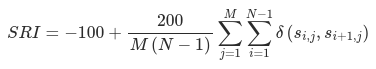

**Requires Epoch data**

##### Definition

The Sleep Regularity Index (SRI) measures the similarity of sleep-wake patterns from one day to the next. It calculates the probability of the subject being in the same state (awake or asleep) 24 hours after a given time-point.

Computing the SRI does not require having a single sleep episode per night (though false sleep events will artificially decrease the SRI value).

##### Interpretation

SRI values range from 0 (random sleep-wake patterns) to 100 (perfectly regular sleep-wake patterns).

Theoretically, negative SRI values (between -100 and 0) are possible if sleep-wake patterns are anti-correlated from one day to the next (e.g. sleep for 24h then wake for 24h). In practice, negative values are very uncommon.

##### References

(1) Fischer, D.; Klerman, E.B.; Phillips, A.J.K. Measuring sleep regularity: theoretical properties and practical usage of existing metrics. Sleep 2021
