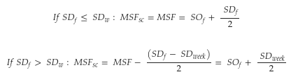
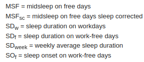

##### Definition

The chronotype is defined here as the midpoint between sleep onset and wakeup times on work-free days.

To account for sleep debt that might be accumulated during the work week, we apply a correction: if the sleep duration on work-free days is longer than on work days, we subtract half of the oversleep, calculated as the difference between average sleep duration in the whole week, and sleep duration on work-free days.

Figure adapted from (1).

##### Interpretation

The chronotype value is the (corrected) time at mid-sleep. For example, a chronotype of 3.5 corresponds to a midsleep of 3:30 am.

Lower values indicate earlier sleep onset and wakeup times, while higher values indicate later sleep onset and wakeup times.

##### References

(1) Roenneberg, T.; Pilz, L.K.; Zerbini, G.; Winnebeck, E.C. Chronotype and Social Jetlag: A (Self-) Critical Review. Biology 2019
