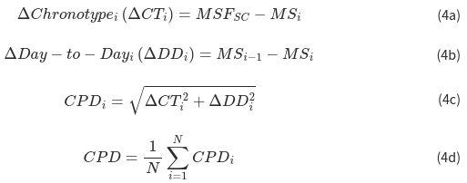

##### Definition

Composite Phase Deviation (CPD) uses the chronotype to assess the regularity of sleep over several days. The steps to calculate CPD from chronotype are as follows:

- **(4a)** Mistiming: difference in hours between midsleep on each day (MSi) and the chronotype (MSFsc)
- **(4b)** Irregularity: difference between midsleep time on each day from the previous day
- **(4c)** Vector length from origin (i.e. perfectly regular sleep) using mistiming and irregularity as dimensions
- **(4d)** Average vector length across all sleep episodes

⚠ CPD calculation is only valid if there is a single sleep episode per night. Check there are no sessions shown in the compliance tab.

##### Interpretation

Lower CPD values reflect more regular sleep, 0 being perfectly aligned and regular sleep.

##### References

(1) Fischer, D.; Klerman, E.B.; Phillips, A.J.K. Measuring sleep regularity: theoretical properties and practical usage of existing metrics. Sleep 2021
