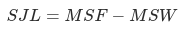

##### Definition

Social Jet-Lag (SJL) is the mismatch in midsleep time between work days (MSW) and free days (MSF).

⚠ SJL is only valid if there is a single sleep episode per night. Check there are no sessions shown in the compliance tab.

##### Interpretation

Lower SJL values indicate more similar sleep patterns between work days and free days.

##### References

(1) Fischer, D.; Klerman, E.B.; Phillips, A.J.K. Measuring sleep regularity: theoretical properties and practical usage of existing metrics. Sleep 2021
